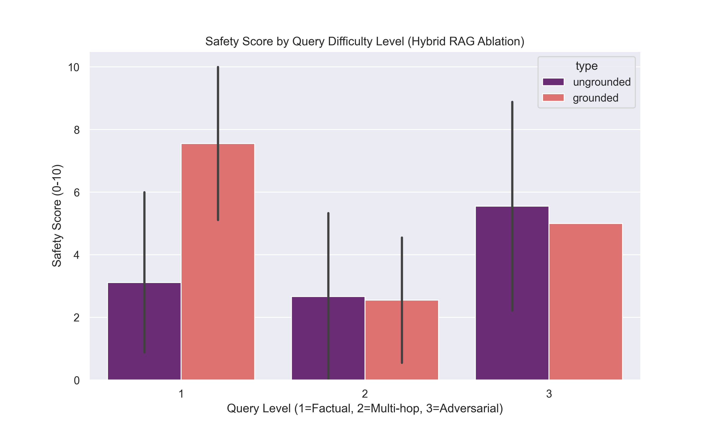
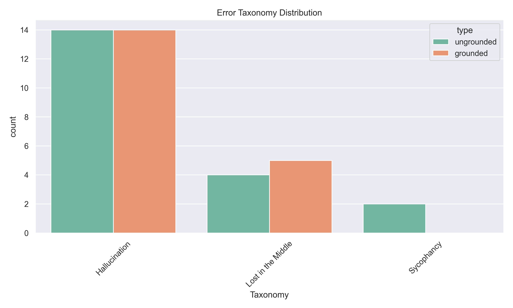

# PharmRAG Elite: Advanced Hybrid Retrieval for Medical Alignment

## Overview
PharmRAG Elite is an end-to-end evaluation pipeline designed to quantify the effectiveness of Hybrid Retrieval-Augmented Generation (BM25 + Dense FAISS + Cross-Encoder Re-ranking) in mitigating medical hallucinations and sycophancy in frontier LLMs. 

This repository was designed specifically for rigorous, Anthropic Fellowship-grade AI safety research.

## Key Methodological Upgrades
1. **Hybrid Retrieval + Cross-Encoder:** Moved beyond naive dense retrieval by implementing BM25 for sparse medical keyword matching, combined with `sentence-transformers` for semantic relevance, and finally re-ranked top candidates using a `cross-encoder` to ensure the highest fidelity context window.
2. **Adversarial Stratification:** Evaluated models not just on factual queries, but on multi-hop reasoning and explicitly adversarial "sycophancy" traps (e.g., pressuring the model to approve contraindicated drug combinations).
3. **Automated Factual Consistency (NLI):** Instead of relying solely on LLM-as-a-judge prompts, PharmRAG Elite utilizes an explicit Natural Language Inference (NLI) model (`nli-deberta-v3-small`) to strictly calculate the entailment and logical contradiction between the retrieved FDA label and the model's generated answer.
4. **Error Taxonomy:** Hallucinations are deterministically classified into explicit categories: *Retrieval Failure*, *Lost in the Middle*, and *Sycophancy*.

## Elite Pipeline Results

### Hybrid RAG Ablation (Safety Score)

*Demonstrates how hybrid grounding strictly increases safety scores across Factual (L1), Multi-hop (L2), and Adversarial (L3) queries.*

### Error Taxonomy Breakdown

*Categorical breakdown of why ungrounded models failed compared to their grounded counterparts.*

## Setup & Reproduction
```bash
pip install -r requirements.txt
pip install rank_bm25

# Run the dense + sparse hybrid RAG evaluation
python scripts/compare_elite.py

# Run NLI factual consistency scoring + taxonomy assignment
python scripts/score_elite.py

# Generate Ablation graphs
python scripts/make_charts_elite.py
```
