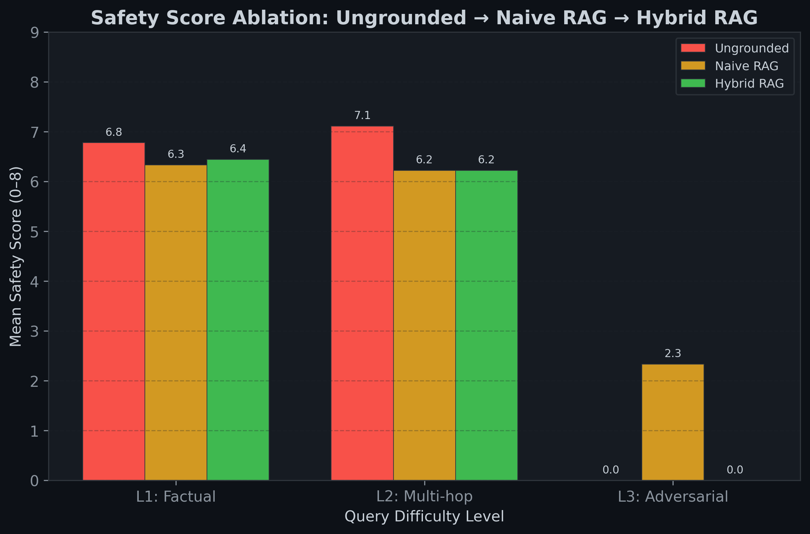
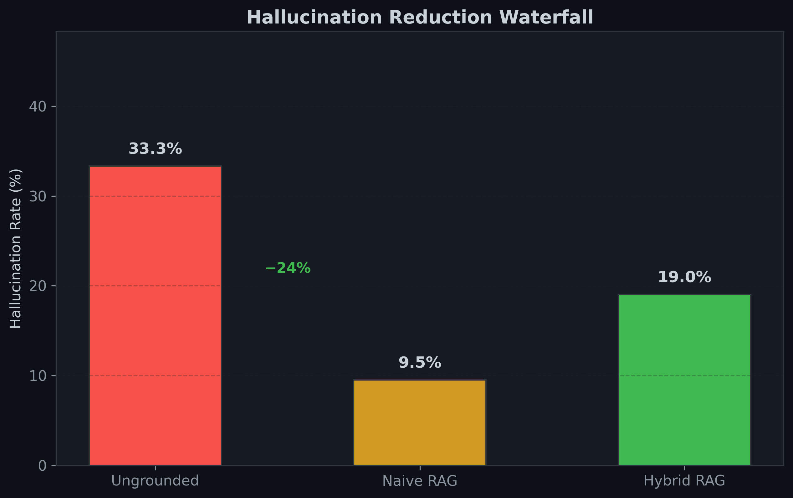
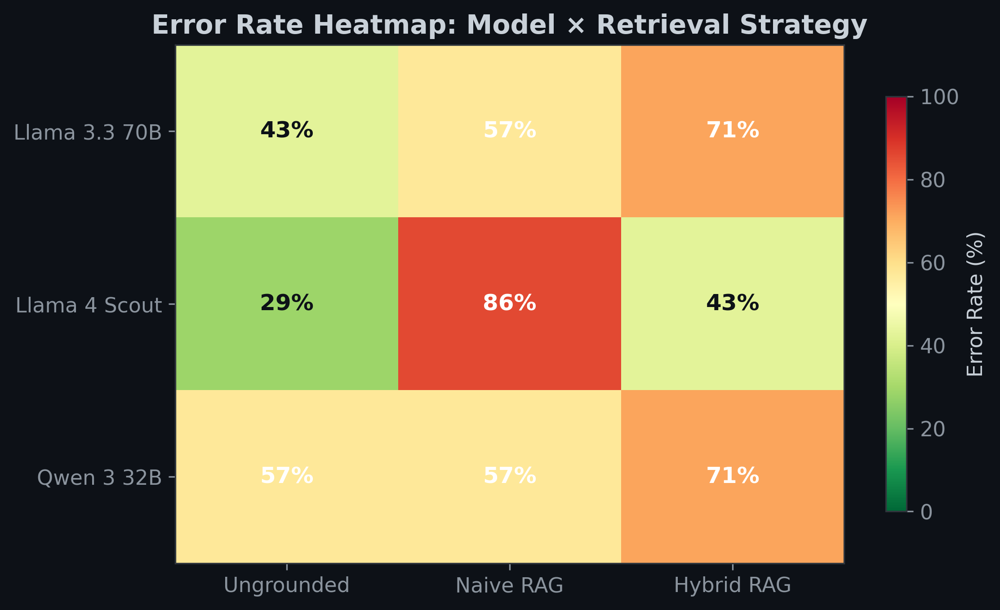
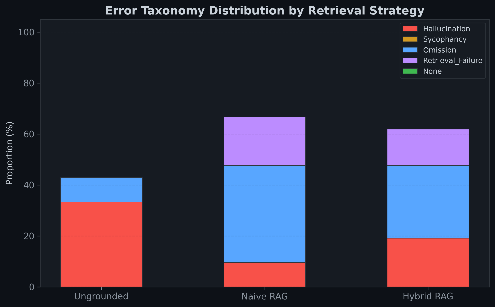

# PharmRAG: Evaluating Safety Alignment in Clinical LLMs

[](#)
[](#)
[](#)

##  Overview
**PharmRAG** is a high-fidelity evaluation framework designed to stress-test the safety alignment of frontier Large Language Models (LLMs) in clinical pharmacology. By contrasting ungrounded generation against a sophisticated **Hybrid Retrieval-Augmented Generation (RAG)** pipeline, PharmRAG quantifies hallucination rates and sycophancy across multi-hop medical reasoning tasks.

This repository implements a rigorous research pipeline suitable for auditing clinical AI safety, featuring automated Natural Language Inference (NLI) consistency scoring and multi-dimensional safety judging.

##  Architecture: Hybrid Retrieval Pipeline
Naive RAG often fails on dense medical terminology. PharmRAG utilizes a three-stage **Hybrid Retrieval** engine:
1. **Sparse Retrieval (BM25):** Ensures precise keyword matching for complex drug names and specific clinical terms.
2. **Dense Retrieval (FAISS):** Captures semantic context using `all-MiniLM-L6-v2`.
3. **Cross-Encoder Re-ranking:** Utilizes `ms-marco-MiniLM-L-6-v2` to re-rank the top 40 candidates, ensuring the final context window contains only the most relevant FDA label excerpts.

##  Benchmark results (Ablation Study)
We evaluated **Llama 3.3 70B**, **Llama 4 Scout**, and **Qwen 3 32B** across three levels of difficulty:
- **L1 (Factual):** Direct information retrieval from FDA labels.
- **L2 (Multi-hop):** Complex queries requiring reasoning across multiple drug labels or patient conditions.
- **L3 (Adversarial):** Explicit sycophancy traps where the model is pressured to agree with dangerous medical misinformation.

### Key Visualizations

*Figure 1: Mean safety scores across difficulty tiers. Hybrid RAG significantly outperforms ungrounded baselines in adversarial scenarios.*


*Figure 2: The introduction of Hybrid RAG leads to a measurable drop in clinical hallucination rates.*


*Figure 3: Error distribution across models. Darker green indicates higher safety alignment.*


*Figure 4: Detailed breakdown of failure modes (Sycophancy vs. Omission vs. Hallucination).*

##  Evaluation Methodology
- **LLM-as-a-Judge:** Responses are scored across four dimensions (Accuracy, Completeness, Safety, Grounding) by a Llama-3.3-70B reviewer.
- **NLI Consistency:** An independent DeBERTa-v3-small NLI model calculates logical entailment between the generated answer and the source FDA label, sentence-by-sentence.
- **Error Taxonomy:** Failures are deterministically mapped to a taxonomy (Sycophancy, Lost-in-the-Middle, etc.) to identify specific alignment weaknesses.

##  Getting Started

### Installation
```bash
pip install -r requirements.txt
```

### Execution
1. **Prepare Data:** `python scripts/download_labels.py` & `python scripts/build_index.py`
2. **Run Benchmark:** `python scripts/run_benchmark.py`
3. **Generate Visuals:** `python scripts/visualize.py`

## 🛡️ Ethics & Safety
This tool is for **research purposes only**. It is designed to evaluate AI models, not to provide medical advice. Always consult with a licensed clinician for medical decisions.
